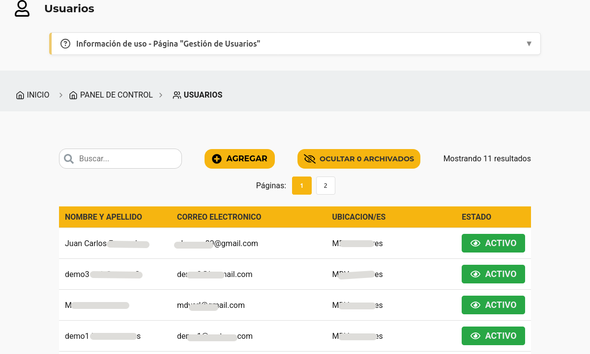
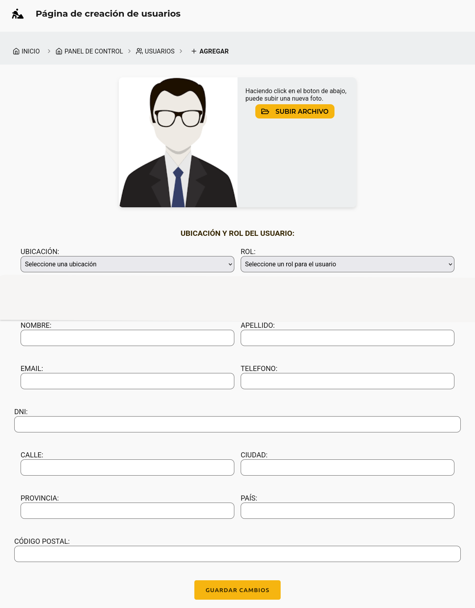
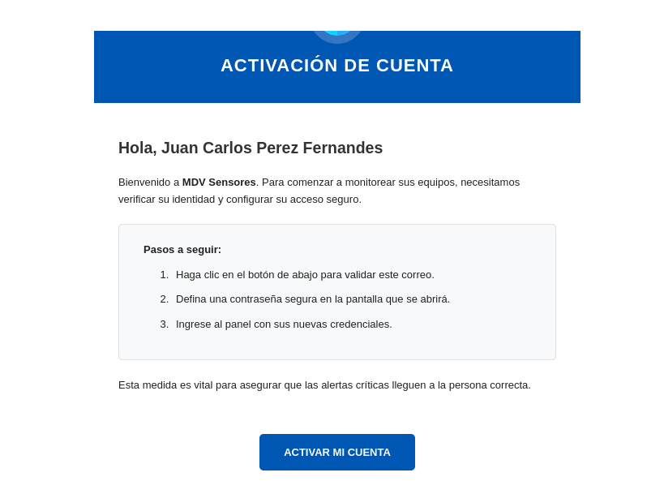
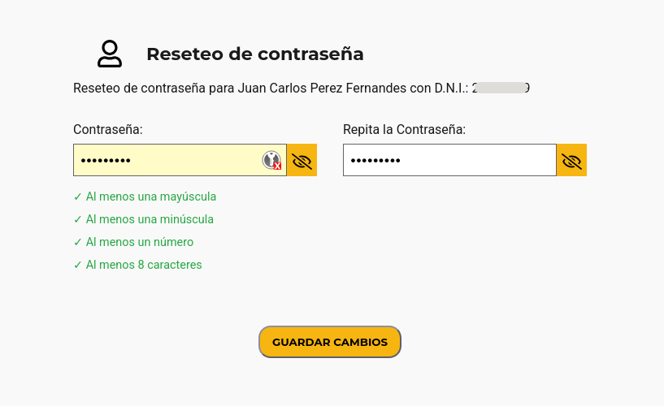

# Tutorial MDV Sensores — Creación de Usuario

> **Nota sobre las imágenes:** las capturas de pantalla de este tutorial se guardan en la carpeta `docs/imagenes/` de este proyecto. Cada sección indica el nombre exacto del archivo que debe tener la captura (ej. `21-agregar-usuario-boton.png`). Para completar el tutorial solo hace falta reemplazar cada placeholder por la imagen correspondiente con ese nombre.

---

## 1. Introducción

Este tutorial explica cómo **crear un nuevo usuario** en MDV Sensores y qué sucede con el **correo de activación** que se envía automáticamente.

La creación de usuarios está reservada a los roles con permisos de administración:

| Rol | ¿Puede crear usuarios? | ¿Qué roles puede asignar? |
|-----|------------------------|---------------------------|
| **Propietario** | ✅ Sí | Administrador y Operario |
| **Administrador** | ✅ Sí | Solo Operario |
| **Operario** | ❌ No | — |

> 💡 **Tip:** si no ve el botón "Agregar" en la sección Usuarios, es porque su rol no tiene permisos de creación. Contacte a su **Propietario** o **Administrador**.

### 1.1 ¿Qué se necesita para crear un usuario?

Antes de crear el usuario, tenga a mano:

- El **nombre, apellido y correo electrónico** de la persona.
- Su **DNI** (entre 7 y 9 dígitos).
- Un **teléfono** de contacto.
- La **dirección completa**: calle, ciudad, provincia, país y código postal.
- La **ubicación** a la que pertenecerá y el **rol** que tendrá.

### 1.2 ¿Qué pasa al crear el usuario?

El usuario se crea en estado **inactivo** y el sistema **envía automáticamente un correo de activación** a la dirección registrada. La persona debe entrar al enlace del correo para definir su contraseña; recién entonces su cuenta queda **activa** y puede ingresar (ver secciones 5 y 6).

---

## 2. Acceso al formulario "Agregar Usuario"

Existen varias formas de llegar al formulario de creación:

1. **Desde el Panel de Control:** presione **PANEL DE CONTROL** en la barra de navegación y luego la tarjeta **Usuarios**. En la página de Usuarios presione el botón **"Agregar"** (esquina superior de la tabla).
2. **Desde el inicio:** en la página de Inicio, use el acceso directo que dice **"Agregar usuario"**.
3. **Desde una ubicación:** entre al detalle de la ubicación y presione el botón **"Usuarios"**; allí también verá el botón **"Agregar"**.

> ⚠️ **Importante:** el botón **"Agregar"** solo se muestra a usuarios con rol **Propietario** o **Administrador** en la ubicación seleccionada.

## 3. Completar el formulario

El formulario de creación se divide en dos secciones.

### 3.1 Ubicación y Rol del usuario

- **Ubicación:** seleccione la ubicación a la que pertenecerá el usuario. Solo se muestran las ubicaciones a las que usted tiene acceso.
- **Rol:** elija el rol del usuario:
  - **Administrador:** puede administrar usuarios y crear Operarios.
  - **Operario:** rol de solo lectura (ver ubicaciones, dataloggers, canales y alarmas).
  - Según su rol, el sistema ofrece uno u otro (ver sección 1).

> 💡 **Tip:** si el usuario trabajará en varias ubicaciones, deberá crear el usuario una vez por cada ubicación a la que tenga acceso, asignando el rol correspondiente en cada una.

### 3.2 Datos del usuario

Complete los siguientes campos (todos son obligatorios):

- **Foto de perfil** *(opcional):* puede cargar una imagen. Si no se carga, se usa la imagen por defecto.
- **Nombre:** solo letras, mínimo 2 caracteres.
- **Apellido:** solo letras, mínimo 2 caracteres.
- **Email:** debe ser una dirección de correo válida. A este correo se enviará la activación.
- **Teléfono:** número de contacto con formato válido.
- **DNI:** entre 7 y 9 dígitos. No se puede repetir: si el DNI ya existe en el sistema, el formulario lo rechazará.
- **Calle:** mínimo 3 caracteres.
- **Ciudad / Provincia / País:** mínimo 2 caracteres cada uno.
- **Código Postal:** formato válido.

> ⚠️ **Importante:** en este formulario **no se define una contraseña**. El sistema la genera internamente y el nuevo usuario la establece cuando activa su cuenta (sección 6). Por eso el email debe ser correcto: es el único canal para que la persona active su cuenta.

## 4. Guardar y verificar el usuario creado

1. Revise que todos los campos estén completos y correctos.
2. Presione **"Guardar cambios"**.
3. Si todo está bien, verá el mensaje ✅ **"Usuario creado con éxito"** y el sistema lo llevará automáticamente al **detalle del usuario**.
4. En el detalle podrá verificar los datos cargados. El usuario figura en estado **inactivo** hasta que active su cuenta.

> ⚠️ **Posibles errores al guardar:**
> - ❌ **DNI o email ya registrados:** el sistema rechaza la creación. Verifique los datos o contacte al Propietario.
> - ❌ **Error de conexión con el servidor:** revise su conexión e intente nuevamente.

## 5. El correo de activación

En el momento en que crea el usuario, el sistema **envía automáticamente un correo de activación** a la dirección de email registrada.

- El correo llega de **MDV Sensores** e incluye un **enlace de activación** único y personal.
- El enlace lleva a la página **"Reseteo de contraseña"**, donde el nuevo usuario definirá su contraseña.
- El enlace es de **un solo uso** y tiene **vigencia limitada**.

> 💡 **Tip:** indíquele a la persona que revise también la bandeja de **correo no deseado (spam)** si no encuentra el mensaje.

---

## 6. Activación por el nuevo usuario

Una vez que la persona ingresa al enlace del correo:

1. Se abre la página **"Reseteo de contraseña"**, que muestra el **nombre y DNI** del usuario.
2. Debe completar **Contraseña** y **Repita la Contraseña**.
3. La contraseña debe cumplir los siguientes requisitos (el formulario lo indica en vivo con ✓):
   - Al menos **una letra mayúscula**.
   - Al menos **una letra minúscula**.
   - Al menos **un número**.
   - Al menos **8 caracteres** de largo.
   - Las dos contraseñas deben coincidir.
4. Presiona **"Guardar cambios"**. Si todo está correcto, verá un mensaje de confirmación.
5. La cuenta queda **activa** y la persona es redirigida al inicio del sistema para ingresar con su **DNI** y la nueva contraseña.

> 🔒 **Seguridad:** el enlace de activación es personal y de un solo uso. No debe compartirse. Si el enlace venció o no funciona, solicite un nuevo correo (sección 7).

---

## 7. ¿No llegó el correo de activación?

Si la persona no recibió el correo:

1. Verifique que la dirección de email cargada sea correcta en el detalle del usuario.
2. Pídale que revise la bandeja de **correo no deseado (spam)**.
3. Solicite el reenvío: en la pantalla de ingreso use el enlace **"¿Ha olvidado su contraseña?"** (o "Solicite el restablecimiento aquí"), ingrese el email y presione **"Enviar Correo"**. El sistema reenviará el correo de activación/restablecimiento a esa dirección.
4. Si aún así no llega, puede borrar y volver a crear el usuario (o editar su correo) y el sistema enviará un nuevo correo de activación.

> ⚠️ **Nota:** el sistema informa de forma genérica ("Si el correo existe en nuestro sistema, se envió...") para no revelar cuentas registradas. Si la persona no recibe nada, lo más probable es que el correo no esté registrado o que la dirección sea incorrecta.

---

## 8. Preguntas frecuentes

### 8.1 "No veo el botón para Agregar usuario"

Su rol es **Operario** (solo lectura) o no tiene el permiso en la ubicación seleccionada. Contacte a su **Propietario** o **Administrador** para crear el usuario.

### 8.2 "El DNI ya existe" / "El email ya está registrado"

El sistema no permite duplicar DNI ni correos. Verifique si el usuario ya fue creado antes o si los datos están escritos correctamente. En caso de duda, consulte al **Propietario**.

### 8.3 El usuario creado no aparece en mi listado

Cada ubicación muestra solo a sus propios usuarios. Si creó al usuario en otra ubicación o tiene un rol distinto en esa ubicación, el usuario no aparecerá allí. Revise que esté viendo la ubicación correcta en el selector.

### 8.4 El usuario dice que el enlace de activación no funciona

El enlace puede haber **vencido** o ya fue **utilizado**. Use la opción "¿Ha olvidado su contraseña?" de la pantalla de ingreso para enviar un nuevo correo (sección 7).

### 8.5 El nuevo usuario no puede iniciar sesión

La cuenta sigue **inactiva** si no completó la activación. Confirme en el detalle del usuario que el estado esté **activo**. Si no, reenvíe el correo de activación (sección 7).
