# Tutorial MDV Sensores — Usuario Operario

> **Nota sobre las imágenes:** las capturas de pantalla de este tutorial se guardan en la carpeta `docs/imagenes/` de este proyecto. Cada sección indica el nombre exacto del archivo que debe tener la captura (ej. `01-reseteo-contrasena.png`). Para completar el tutorial solo hace falta reemplazar cada placeholder por la imagen correspondiente con ese nombre.

---

## 1. Introducción

MDV Sensores es un sistema de monitoreo en tiempo real de equipos electromecánicos (dataloggers). Su objetivo es supervisar parámetros críticos de clínicas, hospitales y otras organizaciones, para detectar fallas y evitar interrupciones operativas.

### 1.1 ¿Qué puedo hacer como Operario?

El rol **Operario** es un rol de **solo lectura**: usted puede **ver y consultar** toda la información del sistema, pero **no puede crear, editar ni eliminar** entidades.

| Puede hacer ✅ | No puede hacer ❌ |
|----------------|------------------|
| Ver ubicaciones, dataloggers, canales y alarmas | Crear/editar ubicaciones, usuarios, dataloggers o canales |
| Ver el estado en línea/sin conexión de los equipos | Archivar/desarchivar entidades |
| Ver gráficos históricos de los canales | Generar informes (reservado a Administrador/Propietario) |
| Ver sus alarmas asignadas y su historial | Ver el historial del servidor (solo Propietario) |
| Confirmar que vio un aviso de alarma recibido por correo | Suscribir o desuscribir usuarios a alarmas |

> 💡 **Tip:** si necesita crear, editar o modificar algo, contacte a su **Administrador** o **Propietario**.

### 1.2 Jerarquía de entidades

Para orientarse en el sistema, recuerde la siguiente jerarquía:

```
Ubicación (clínica, hospital, sucursal)
 └── Datalogger (equipo de medición)
      └── Canal (parámetro que se mide: temperatura, % de encendido, etc.)
           └── Alarma (regla que avisa cuando el valor sale de rango)
```

- **Ubicación:** una instalación o lugar de trabajo.
- **Datalogger:** el equipo físico que captura datos en la ubicación.
- **Canal:** cada medición que realiza el datalogger (puede tener varios canales).
- **Alarma:** una condición configurada sobre un canal (o sobre el datalogger) que se dispara cuando el valor supera o baja un umbral.

---

## 2. Primer acceso: activación de su cuenta

Cuando el administrador crea su usuario, usted recibe un **correo electrónico de activación** con un enlace.

1. Abra el correo y haga clic en el enlace recibido.
2. Se abrirá la página **"Reseteo de contraseña"**, que muestra su nombre y DNI.
3. Complete **Contraseña** y **Repita la Contraseña**.
4. La contraseña debe cumplir todos estos requisitos (el formulario lo indica en vivo con ✓):
   - Al menos **una letra mayúscula**.
   - Al menos **una letra minúscula**.
   - Al menos **un número**.
   - Al menos **8 caracteres** de largo.
   - Las dos contraseñas deben coincidir.
5. Presione **"Guardar cambios"**. Si todo está correcto, verá un mensaje de confirmación.
6. Será redirigido al inicio del sistema para ingresar con sus nuevas credenciales.

> ⚠️ **Importante:** el enlace de activación es de un solo uso. Si no llegó el correo o el enlace venció, solicite a su administrador que le reenvíe la activación, o use la opción "¿Ha olvidado su contraseña?" (sección 3).


> **📸 Captura requerida** — Formulario "Reseteo de contraseña para [Nombre] con D.N.I.: [DNI]".
> - **Dónde:** ingresar al enlace del correo de activación (ruta `/resetear`).
> - **Qué debe mostrar:** los dos campos de contraseña (Contraseña y Repita la Contraseña), el checklist de requisitos con ✓/• y el botón "Guardar cambios".
> - **Consejo:** desenfocar u ocultar el DNI real si la captura es de un entorno real.

---

## 3. Inicio de sesión

1. Diríjase a la página de **Inicio** del sistema y presione el botón **"Ingresar"**.
2. Complete los campos:
   - **DNI:** su número de documento.
   - **Contraseña:** la clave que definió en la activación.
3. Puede usar el ícono del **ojo** para mostrar/ocultar la contraseña mientras la escribe.
4. Presione **"Iniciar Sesión"**.

Posibles mensajes:

- ✅ **"Sesión iniciada correctamente"** → es redirigido al **Panel de Control**.
- ❌ **"DNI y/o contraseña incorrectos"** → verifique sus datos e intente de nuevo.
- ❌ **"Error de conexión con el servidor"** → revise su conexión a internet e intente nuevamente.

**¿Olvidó su contraseña?**

En la misma pantalla de ingreso, use el enlace **"Solicite el restablecimiento aquí"**:

1. Ingrese el correo electrónico con el que está registrado.
2. Presione **"Enviar Correo"**.
3. Recibirá un correo con un enlace para restablecer la contraseña (mismos requisitos de la sección 2).

> 🔒 **Seguridad:** por seguridad, su sesión se cierra automáticamente cuando vence su token de acceso. Si lo expulsa del sistema, simplemente vuelva a ingresar.

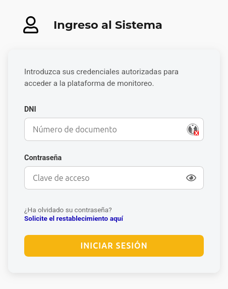

## 4. Barra de navegación (menú superior)

Una vez dentro del sistema, en la parte superior encontrará la barra de navegación con las siguientes opciones:

| Opción | Función |
|--------|---------|
| **Logo (MDV Sensores)** | Lo lleva a la página de Inicio |
| **INICIO** | Página de inicio con accesos rápidos |
| **PANEL DE CONTROL** | Panel principal con las secciones del sistema |
| **MIS ALARMAS** | Las alarmas asignadas a su usuario |
| **Selector de Ubicaciones** | Cambia entre las ubicaciones a las que tiene acceso |
| **Su nombre y apellido** | Lo lleva a su perfil de usuario |
| **Salir** | Cierra la sesión y lo lleva al inicio público |

### 4.1 Selector de ubicaciones

El sistema es **multi-ubicación**: usted puede tener acceso a una o varias ubicaciones, con un rol en cada una.

- El selector muestra la ubicación activa actual.
- Al abrirlo, verá la lista de sus ubicaciones con el rol asignado a cada una (ej. **"Hospital Central — Operario"**).
- Al elegir otra ubicación, el sistema navega al detalle de esa ubicación y todo lo que vea (dataloggers, canales, alarmas) quedará restringido a esa ubicación.

> 💡 **Tip:** si no ve una ubicación en el selector, significa que no tiene acceso asignado a ella. Pídale al administrador que le asigne los permisos correspondientes.


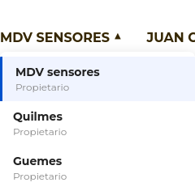


## 5. Inicio y Panel de Control

### 5.1 Página de Inicio

Al entrar al sistema, verá la página de inicio con la bienvenida **"Bienvenido [Su nombre]"** y los siguientes accesos rápidos:

- **Ir al panel de control** — lo lleva al Panel de Control.
- **Ver tus alarmas** — lo lleva al listado de sus alarmas.
- **Ver tu perfil** — lo lleva a su perfil de usuario.
- **Enviarnos un mensaje** — lo lleva a la página de contacto.

### 5.2 Panel de Control

El **Panel de Control** (`/panel`) es el punto de partida para consultar toda la información. Contiene tres tarjetas principales:

- **Ubicaciones:** muestra la cantidad de ubicaciones a las que tiene acceso, con un acceso directo a cada una y su rol.
- **Usuarios:** muestra los usuarios registrados de su ubicación (para un operario es información de solo lectura).
- **Dataloggers:** muestra los equipos activos con un acceso directo a cada uno.

Cada página del panel incluye, además, un acordeón de **"Información de uso"** en la parte superior que explica qué puede hacer en esa sección según su rol.

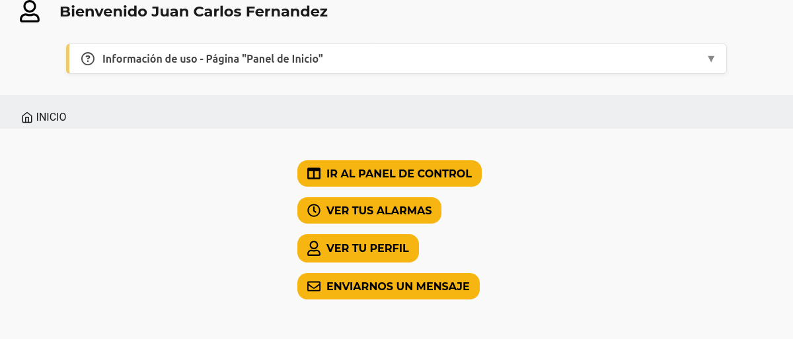


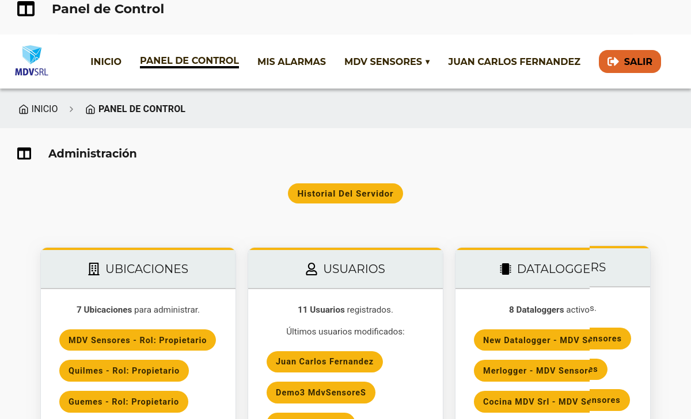

## 6. Ubicaciones

### 6.1 Listado de ubicaciones

- Ingrese por **PANEL DE CONTROL → tarjeta Ubicaciones** o por el **selector de ubicaciones**.
- Verá la página **"Ubicaciones"** (`/panel/ubicaciones`) con las ubicaciones a las que tiene acceso.
- Puede **buscar** una ubicación escribiendo su nombre en el campo de búsqueda.
- Haga clic en una ubicación para ver su detalle.

### 6.2 Detalle de ubicación

Al entrar a una ubicación (`/panel/ubicaciones/:uuid`) podrá consultar:

- **Descripción, dirección, teléfono y correo electrónico** de contacto.
- **Fecha de creación** de la ubicación.
- **Dataloggers asociados:** los equipos instalados, con acceso directo a cada uno.
- **Alarmas activas:** botón "Ver N alarmas" con el total de alarmas de todos los equipos de la ubicación.
- **Usuarios asociados:** botón para ver los usuarios que pertenecen a esa ubicación.
- Sección **"Dataloggers en [ubicación]"** con las tarjetas de cada equipo.

> ⚠️ **Para un Operario** los botones "Editar" y "Archivar" no se muestran (son exclusivos del Propietario).

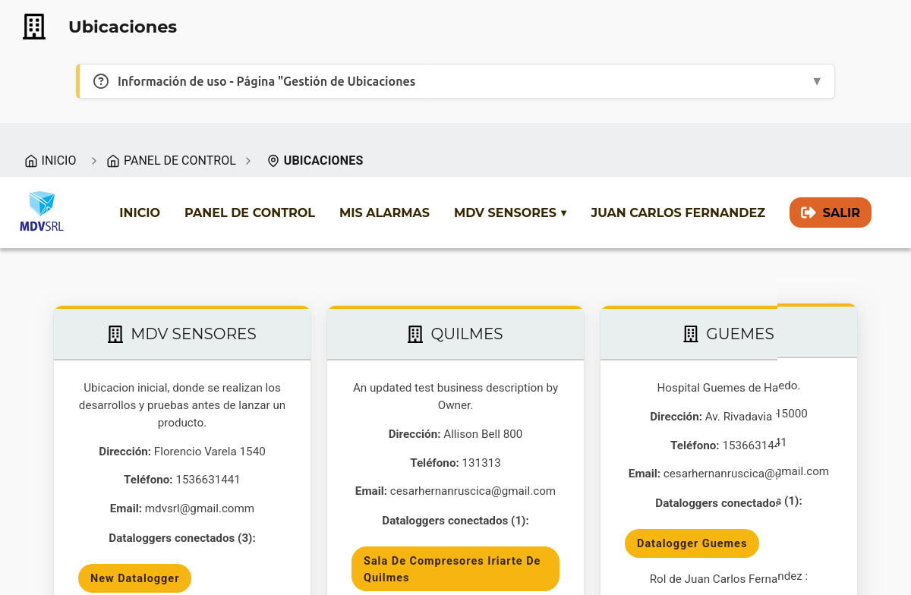


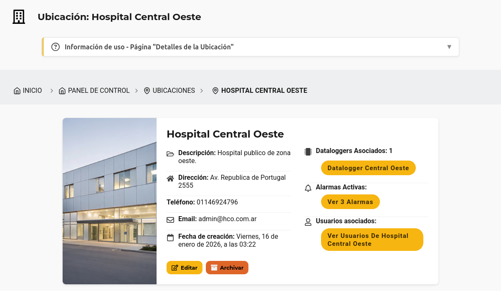


## 7. Dataloggers

### 7.1 Listado de dataloggers

- Desde el detalle de una ubicación, haga clic en cualquiera de los dataloggers asociados, o use la sección **"Dataloggers en [ubicación]"**.
- Verá la página **"Dataloggers"** (`/panel/ubicaciones/:uuid/dataloggers`) con las tarjetas de los equipos.
- Puede **buscar** equipos por nombre.
- Cada tarjeta permite entrar al detalle del equipo.

### 7.2 Detalle de datalogger

Al entrar a un datalogger (`/panel/ubicaciones/:uuid/dataloggers/:dlId`) verá:

- **Estado de conexión** (muy importante): la etiqueta **"Últimos datos recibidos"** con un indicador:
  - 🟢 **En línea:** se recibieron datos en los últimos 10 minutos.
  - 🔴 **Sin conexión:** no se reciben datos desde hace más de 10 minutos.
  - ⚪ **Sin datos aún:** el equipo todavía no envió mediciones.
  - La fecha y hora de la última conexión.
- Sección **"Canales del datalogger [nombre]"** con las tarjetas de cada canal (ver sección 8).

> ⚠️ **Para un Operario** los botones "Editar", "Archivar" y "Agregar canal" no se muestran.

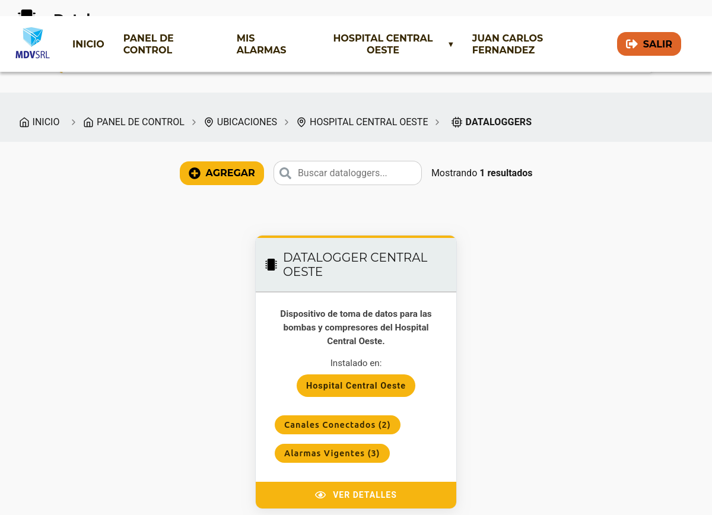


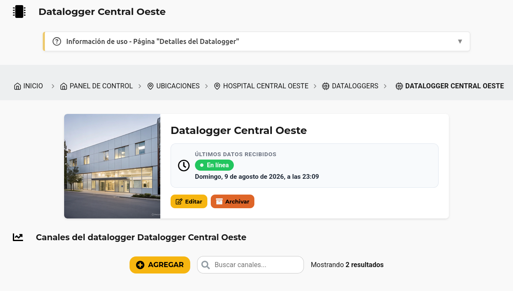


## 8. Canales

### 8.1 Listado de canales

- Desde el detalle del datalogger, verá la sección **"Canales del datalogger"**.
- Cada tarjeta de canal muestra:
  - **Nombre, imagen y descripción** del canal.
  - **Minigráfico** con los datos históricos recientes del canal.
  - **Alarmas de porcentaje de encendido** vinculadas, con su valor actual y rango.
  - **Badge de tareas pendientes** de mantenimiento si corresponde (ej. "2 tareas pendientes").
- Haga clic en un canal para ver su detalle.

### 8.2 Detalle de canal

Al entrar a un canal (`/panel/ubicaciones/:uuid/dataloggers/:dlId/canales/:channelId`) encontrará:

- **Información del canal:**
  - Descripción.
  - **Tiempo de uso** total (en horas).
  - **Porcentaje de uso total** con la fecha del primer dato registrado.
  - **Últimos datos recibidos** (fecha y hora).
  - **Alarmas programadas** del canal con acceso al listado.
- **Gráfico histórico:** el gráfico de comportamiento del canal con un selector de rango de tiempo:
  - Última hora, últimas 12 hs, últimas 24 hs, última semana, último mes, últimos 6 meses, último año.
  - Cada punto del gráfico integra las lecturas de los últimos N minutos (período de promediado del canal).
  - Si la alarma se disparó en el período, verá marcado el momento del disparo.
- **Alarmas Configuradas:** listado de las alarmas del canal.
- **Mantenimiento:** tareas y observaciones registradas sobre el canal.

> ⚠️ **Para un Operario:** el botón **"Generar Informe"** no está disponible (solo Administrador/Propietario). Tampoco puede crear ni editar registros de mantenimiento; solo consultarlos.

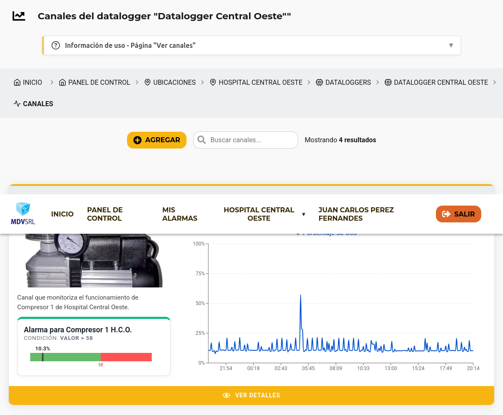


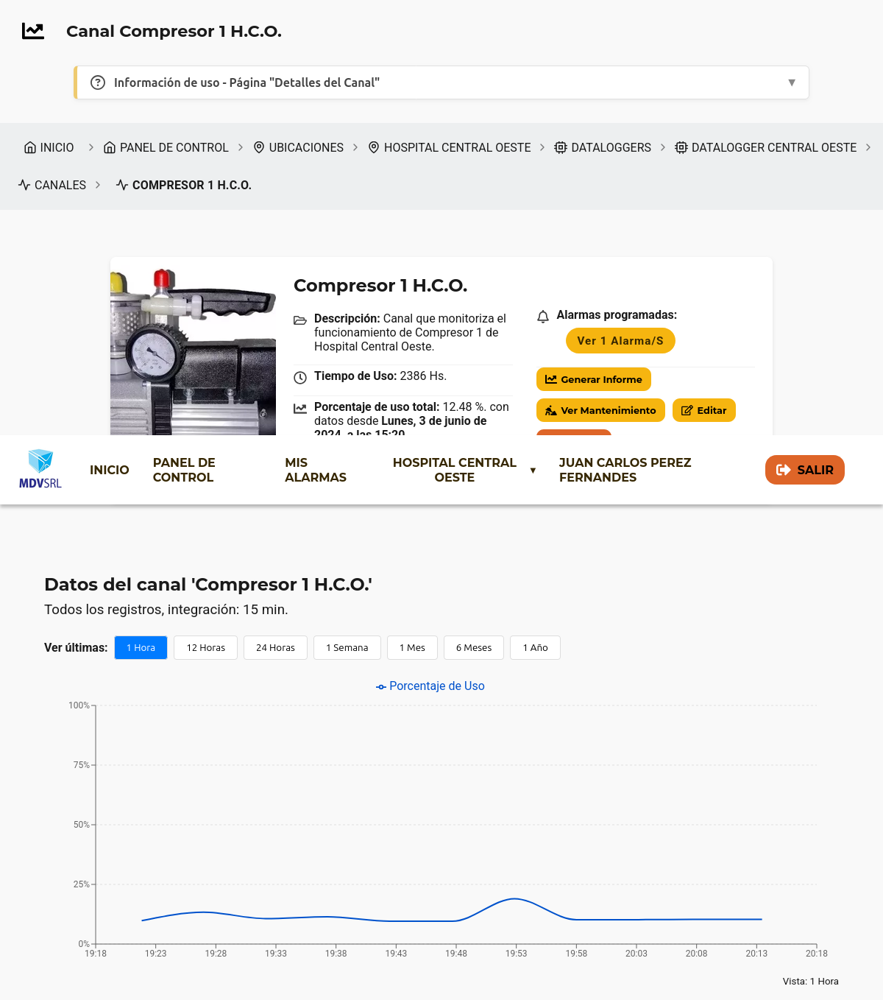


## 9. Alarmas

### 9.1 Tipos de alarma

| Tipo | Qué mide |
|------|----------|
| **Porcentaje de encendido (`porcentage_on`)** | El porcentaje de tiempo en que un **canal** estuvo encendido en el período analizado |
| **Fallo de comunicación (`comunication_failure`)** | Fallos de transmisión de datos del **datalogger** |

### 9.2 Mis Alarmas

- En la barra de navegación presione **"MIS ALARMAS"** (ruta `/panel/alarmas/:userUuid`).
- Verá el listado **de las alarmas asignadas a su usuario**, es decir, las que usted está "suscrito" a recibir por correo.
- Si quiere recibir (o dejar de recibir) avisos de otra alarma, pídale al **Administrador** que lo suscriba o lo desuscriba.

También puede ver listados de alarmas por contexto desde otras pantallas:

- **Por ubicación:** botón "Ver N alarmas" en el detalle de la ubicación.
- **Por datalogger:** alarmas configuradas del equipo.
- **Por canal:** sección "Alarmas Configuradas" del detalle de canal.

### 9.3 Detalle de alarma

Al hacer clic sobre una alarma (`/panel/.../alarmas/:alarmId`) verá:

- **Card de monitoreo:**
  - Nombre de la alarma y **badge de estado**:
    - ⚠️ **ALARMA ACTIVA** (rojo): la condición está fuera de rango en este momento.
    - **Normal** (verde): la condición está dentro del rango.
  - **Condición** de disparo (ej. "mayor que X %" o "menor que X %").
  - **Tipo** de alarma.
  - **Descripción** de la alarma.
  - **Rango de análisis** (últimos N minutos considerados).
  - **Último dato registrado** (fecha y hora).
  - **Fecha de creación**.
- **Gauge (indicador semafórico):** solo para alarmas de porcentaje de encendido. Muestra el valor actual de la aguja:
  - 🟢 **Verde:** valor dentro del rango seguro.
  - 🔴 **Rojo:** valor fuera de rango (zona de alarma).
- **Gráfico:** muestra los datos del canal (o los fallos de transmisión) con los **momentos en que la alarma se disparó** marcados. Solo se muestra si usted está suscrito a la alarma.
- **Historial de disparos:** tabla con columnas:
  - **DIA Y HORA DEL EVENTO** — fecha y hora del disparo o reseteo.
  - **EVENTO** — "Disparada" o "Reseteada".
  - **MENSAJE** — descripción del evento.
  - **USUARIOS NOTIFICADOS** — quiénes recibieron el aviso.
- **Usuarios suscriptos:** tabla de los usuarios que reciben notificaciones de esta alarma (para el operario es de solo lectura).

> ⚠️ **Importante:** si usted **no está suscrito** a una alarma, el sistema le mostrará "Usted no está suscripto a la alarma" y no podrá ver el gráfico ni el historial de esa alarma. Solicite la suscripción al administrador.

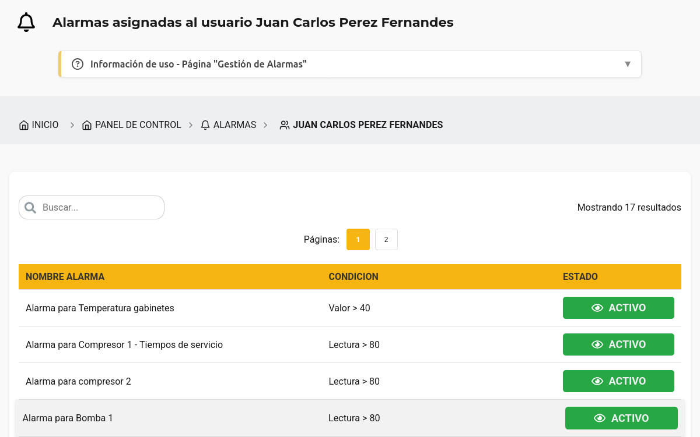

<!--  -->

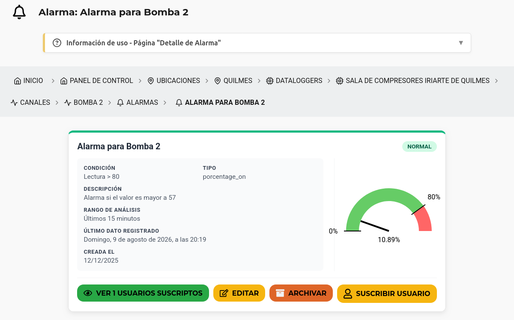


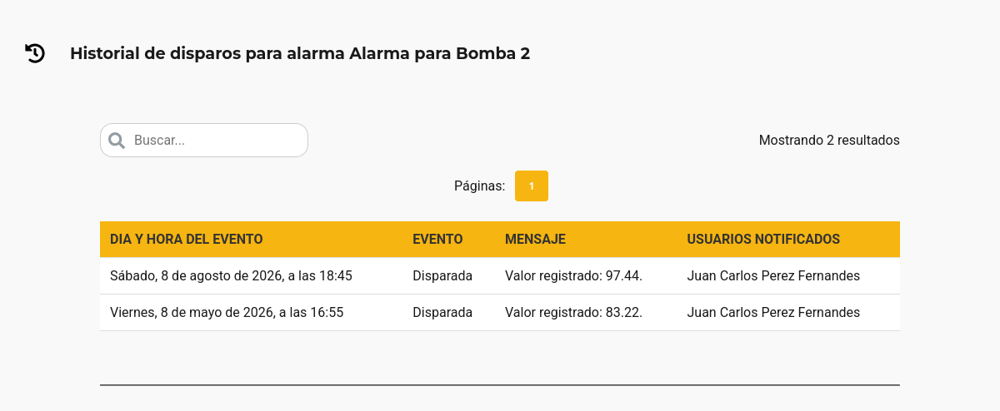


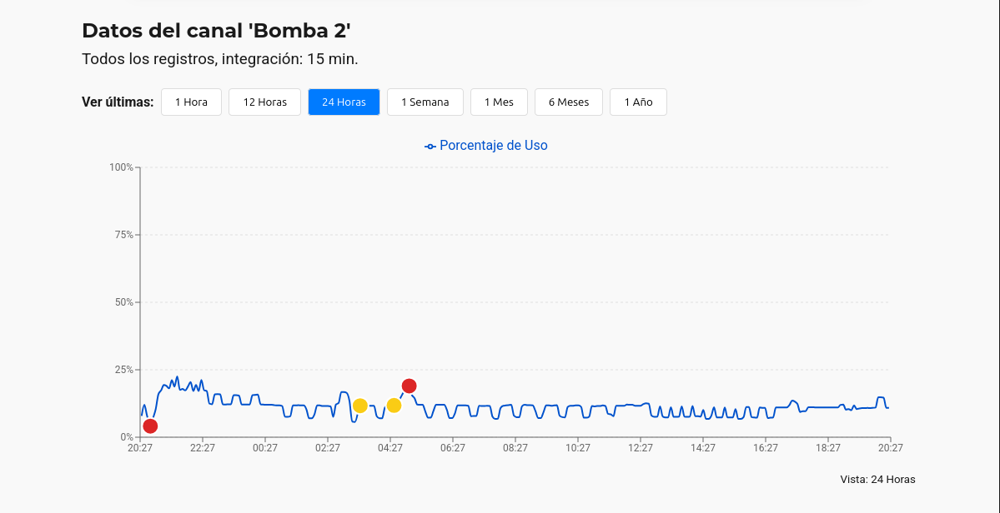

> **📸 Captura requerida** — Gráfico de la alarma con los disparos marcados.
> - **Dónde:** detalle de una alarma (suscrita), sección del gráfico con datos.
> - **Qué debe mostrar:** el gráfico de comportamiento (o de fallos de transmisión) con las **marcas de disparo** sobre la serie, y el selector de rango.
> - **Consejo:** elija un rango (ej. última semana) donde se vea al menos un punto de disparo marcado.

---

## 10. Confirmación de alarma recibida por correo

Cuando una alarma se dispara, los usuarios suscriptos reciben un **correo de notificación**. Ese correo incluye un enlace para confirmar que usted vio la alarma.

1. Abra el correo y haga clic en el enlace.
2. El sistema abre la pantalla de confirmación y registra que **usted vio la notificación** ("Alarma vista").
3. Verá el mensaje: *"El estado del historial de la alarma se actualizó correctamente. Se registró que su usuario [Nombre] vio el correo de alarma."*
4. Presione **"Aceptar"** para ir al detalle de la alarma.

**Posibles errores:**

| Mensaje | Qué significa |
|---------|---------------|
| "El enlace de verificación no es válido." | El enlace está malformado; solicite uno nuevo. |
| "El enlace de verificación ha expirado." | El enlace venció; solicite uno nuevo. |
| "Esta alarma ya fue confirmada anteriormente." | El enlace ya fue utilizado. |
| "El registro de alarma no existe o ya fue eliminado." | La alarma ya no está disponible. |
| "Error de conexión con el servidor." | Revise su conexión e intente nuevamente. |

> 🔒 **Seguridad:** el enlace es personal: solo funciona para el usuario destinatario. Si otra persona intenta abrirlo con su sesión, el sistema lo redirigirá al panel.

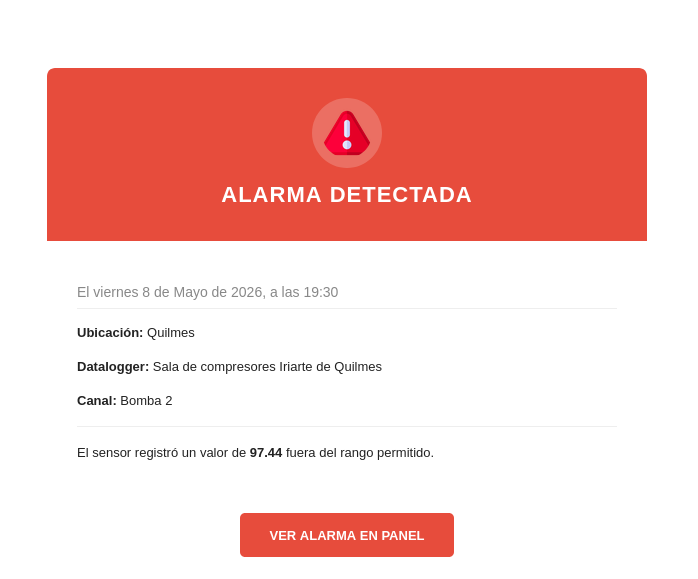

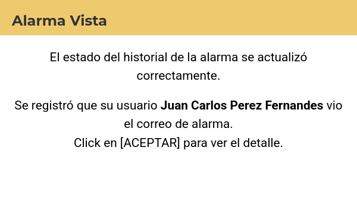

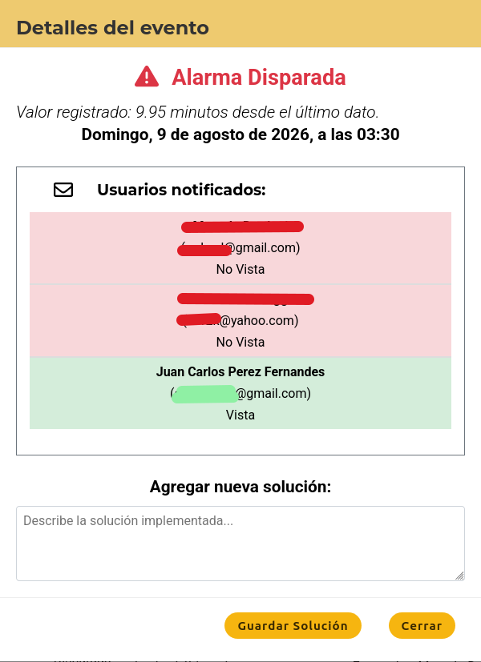


## 11. Preguntas frecuentes y solución de problemas

### 11.1 "Usted no está suscripto a la alarma"

Al abrir una alarma ve el mensaje "Usted no esta Suscripto a la alarma" y no ve el gráfico ni el historial.

**Solución:** pídale al **Administrador** que lo suscriba a la alarma. Una vez suscrito, podrá ver el detalle completo y recibirá los avisos por correo.

### 11.2 No veo los botones para editar o agregar

Es normal: su rol de **Operario** es de solo lectura. Los botones "Agregar", "Editar", "Archivar" y "Generar Informe" están reservados a **Administrador** o **Propietario**.

### 11.3 Me sacó del sistema / "debe iniciar sesión"

Su sesión venció (token expirado). Vuelva a **iniciar sesión** con su DNI y contraseña.

### 11.4 Un datalogger aparece "Sin conexión"

El equipo no envía datos hace más de 10 minutos. Verifique el estado físico del equipo (alimentación, conexión) y contacte al responsable técnico si persiste.

### 11.5 No me llega el correo de activación o de restablecimiento

- Revise la bandeja de **correo no deseado (spam)**.
- Use la opción "¿Ha olvidado su contraseña?" en la pantalla de ingreso para solicitar un nuevo correo.
- Si sigue sin recibirlo, pídale al administrador que verifique el correo con el que está registrado.

### 11.6 Olvidé mi contraseña

Use el enlace **"Solicite el restablecimiento aquí"** de la pantalla de ingreso (ver sección 3) y siga los pasos indicados.

### 11.7 No encuentro una ubicación en el selector

Solo se muestran las ubicaciones a las que tiene **acceso asignado**. Contacte al administrador para solicitar el acceso.
